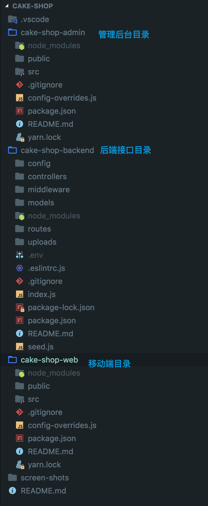
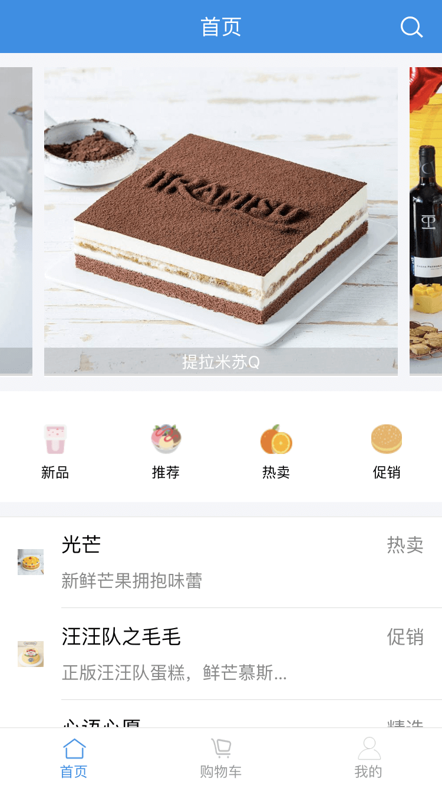
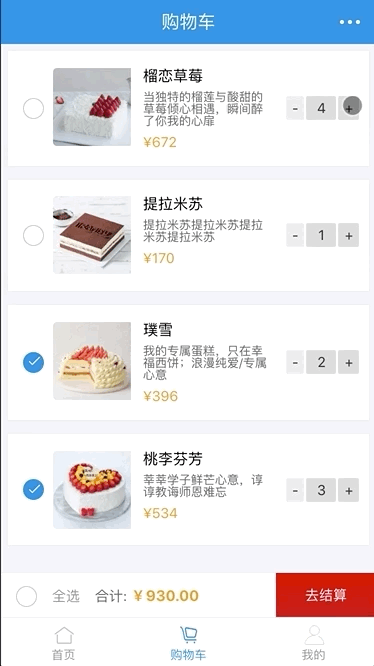
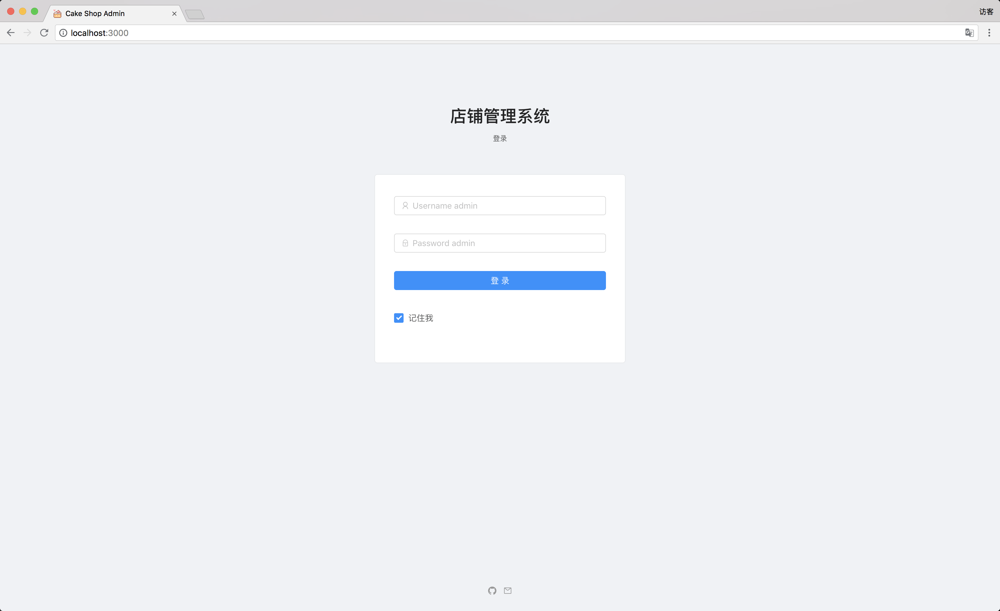
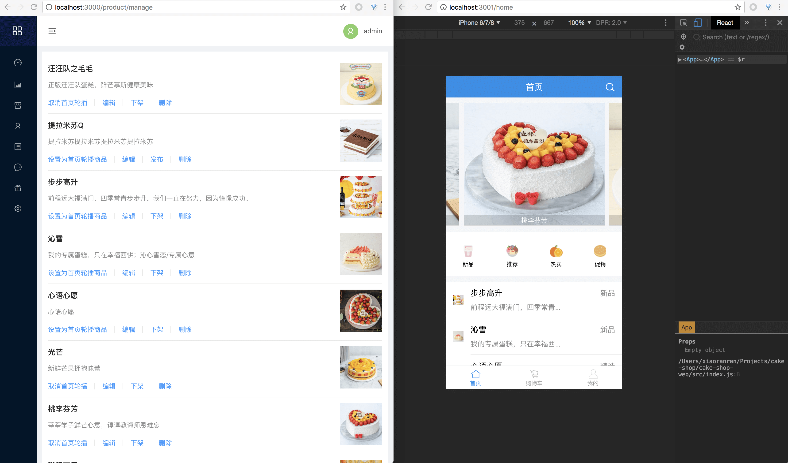
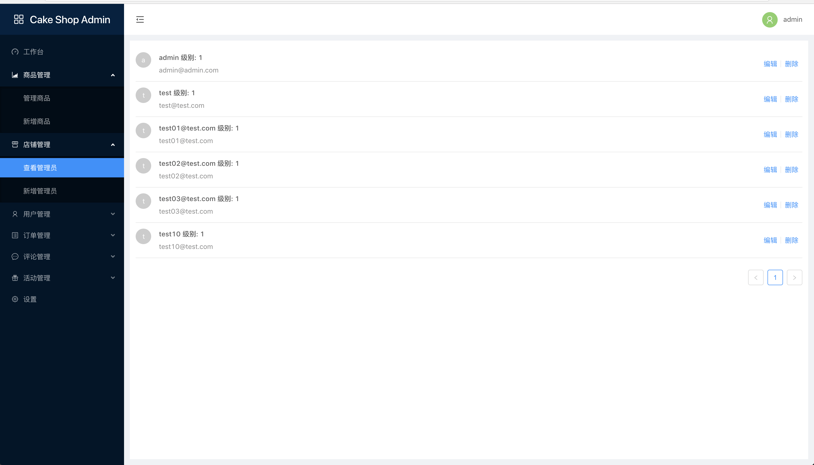
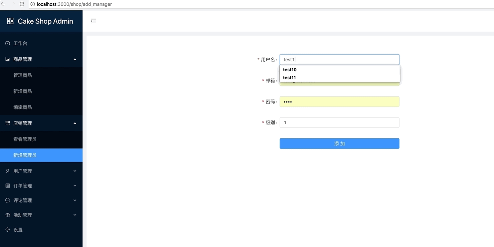
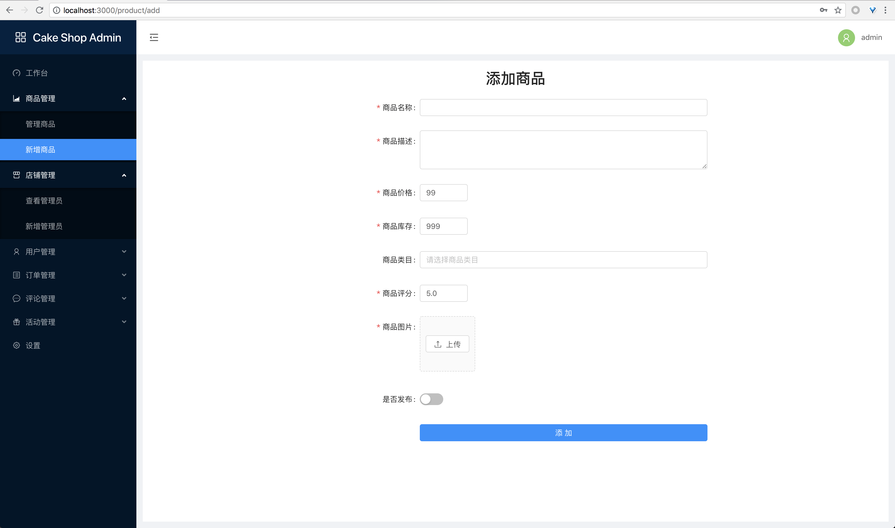

# 🍰 Cake Shop

## 前言

这是一个简易的电商网站项目，由移动端 ，管理后台，后端接口组成，技术栈为前端 `react`, `react-router`, `antd`, `antd-mobile` 等，后端 `express`, `jsonwebtoken`, `mongoose`, `mongodb` 等，项目目录结构为

## 展示

移动端首页



移动端购物车



管理后台登录



管理后台操作界面



查看管理员



添加管理员



新增商品



## 实现的功能

- 移动端首页 ，购物车，我的页面
- 管理后台注册，登录， 店铺管理，商品管理界面
- 管理后台添加商品， 发布商品，删除商品等功能
- 管理后台的管理员登录，注册，新增，删除功能
- 普通用户的登录，注册，新增，删除后端接口
- 设置移动端首页轮播商品功能
- 商品图片上传接口

## 待实现功能

- 移动端商品详情，用户订单等页面
- 管理后台订单管理，活动管理，评论管理，用户管理，工作台，设置等界面
- 后端评论，活动，订单，用户等接口

## 开发

本地启动 `mongodb` 服务

```sh
git clone git@github.com:xrr2016/cake-shop.git

cd cake-shop

# 后端服务
cd cake-shop-backend

npm run dev

# 管理后台
cd cake-shop-admin

yarn start

# 移动端页面
cd cake-shop-web

yarn start
```

## Licence

[MIT](./License)
